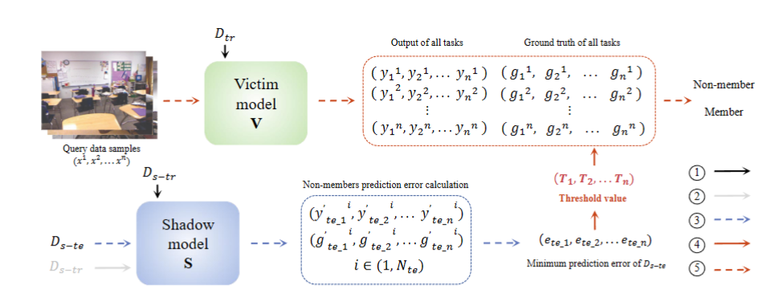
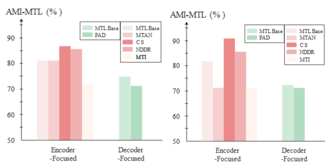

# Privacy Leak Peril in Multi-Task Learning: Black-box Membership Inference Attacks and Discussion

> More details of this project will be released soon.
# Overview

# Benchmark

# How to use this code
### File Details

1. main.py: The main executable file for the multi-task model, used for training the model and generating test results.

2. MEA_test.py: The multi-task model's result-stealing test file, used to experiment with the model's result-stealing capabilities.

3. MIA_test.py: The multi-task model's member inference attack test file, used to experiment with member inference attack results.

### Execution Notes:

1. Model execution, training, saving, and validation are all guided by the key pivot p (a dictionary). If anything is unclear, you need to debug p for details or print the query.

2. Model training guidance information is saved in the ./files/models/yml/model_name/ directory. This guidance information includes training batches, save locations, etc. It can be modified before execution, but cannot be modified during execution.

3. Multi-task model execution results are saved in the ./files/result/NYUD/model_name/ directory. ./task_name (e.g., multi_task_baseline)/checkpoint.pth.tar stores the current training results and can be reloaded for continued training. ./task_name (e.g., multi_task_baseline)/best_model.pth.tar stores the current best training results. The ./task_name (e.g., multi_task_baseline)/result/ directory stores validation information, i.e., the output images generated by the best model.

4. MEA and MIA experimental results are in the format of class 3. The directory structure is MEA_result, which stores the algorithm execution model results.
